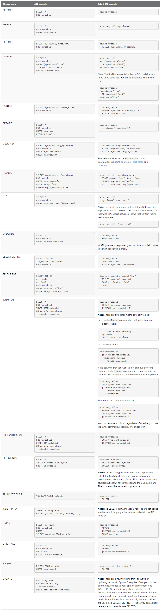

# Splunk

## Overview

### 1. Universal Forwarder

- Fewer hardware resources than other tools
- = Agent to collect log files

### 2. Indexer

- Clustering indexation for replication

### 3. Search Head

- Required by Indexers

## Registering a new application

- Set current users as power users (dashboard crud) or standard user (dashboard read-only)

## How to connect logs to Splunk

- Main ways to follow the logs :

*By DB*: not recommended  
*By Files*: recommended  
*Queues, plug-ins, ...*

- How to connect log files to Splunk:
  - Request File System for new Agent Installation
  - Configure Indexer
  - Configure Agent.

## Configuring Dashboards

- /!\ Follow naming conventions

## Using Splunk: How to search from logs

- See Cheat sheets, Youtube tutorials, ... (links below)
- SQL to Splunk (http://docs.splunk.com/Documentation/Splunk/latest/SearchReference/SQLtoSplunk): 

## To go further...

- Youtube channel: "Splunk How-To": https://www.youtube.com/channel/UCjwOFZzLPnji1EstaVyyvAw
- Reference Manual: http://docs.splunk.com/Documentation/Splunk/7.1.2/SearchReference
- Cheat sheets : http://wiki.splunk.com/images/a/a3/Splunk_4.x_cheatsheet.pdf and https://www.splunk.com/pdfs/solution-guides/splunk-quick-reference-guide.pdf
- Training Fundamentals One : https://www.splunk.com/en_us/training/free-courses/splunk-fundamentals-1.html
 
## Fundamentals One

### Introduction

- 5 functions: Index Data + Search & Investigate + Add Knowledge + Monitor & Alert + Report & Analyze
- 3 main components: 
  - Indexer (process incoming data). Creates files organized with directories by age
  - Search Head: Splunk Search Language from user. Provides tools (dashboards, reports, visualizations)
  - Forwarders (Splunk Enterprise instances) : consumes data and send them to Indexers.
- Single instance or distributed infrastructure
- 3 main roles:
  - Admin: Install apps, create knowledge objects
  - Power: create knowledges, realtime searches
  - User:  see own and shared knowledges

### Installing Splunk (single instance)

- splunk.com > Free Splunk > Login > Splunk  Enterprise > Download Now
- 3 ways to add data
  - Upload file: manual import of a file
  - Monitor files: files, directories, http events, network ports, data from scripts, OS metrics, ...
  - Forward data: receive from forwarders. Main source for production environments.
- Sourcetypes
  - Categorize data being indexed.
  - Automatically detected after a file was added, can be changed.
  - Possible to customize and create new sourcetypes
- Indexes
  - Choose one index by data type (Webdata, Main, Security Index, ...)
  - Limit amoutn of data to search, more precise, access by user roles, different time intervals.
- Forwarders

### Search language

- 5 types of search
  - Search terms
    - "Where" conditions
  - Commands
    - What to do with search results (charts, formatting, statistics, ...)
  - Functions
    - How to chart, how to compute, how to evaluate
  - Arguments
    - Variable for functions
  - Clauses
    - Grouping functions
- Search structure
  - terms | commandfunction{arguments} as clause | ...
- Some commands
  - Field selection: terms | fields \<name1>, \<name2>, ...
  - Table representation: terms | table \<name1>, \<name2>
  - Rename fields: terms | rename \<field_name> as \<new_name>
  - Deduplicate results: terms | dedup \<field1>, \<field2>
  - Sorting : terms | sort +/-\<field1>, +/-\<field2>
  - limit results: terms limit=42
- Transforming commands
  - Most common values: terms | top \<field1>, \<field2> (by \<field>) limit=(int) countfield=(string, field title) percentfield= (string) showcount=(bool) showperc=(bool) useother=(bool) otherstr=(string, other label)
  - Least common values: terms | rare
  - Statistics: count, distinct_count, sum, average, list (values of a field), values (unique values of field): terms | stats <keyword> (as "label") (by \<field>)

## Search examples

- Date & Time
  - `earliest=-2h latest=-1@h (@: round down)`
  - `earliest=01/08/2018:12:00:00`
  - Generate list of 7 last days : `| gentimes start=-7 | eval date = strftime(starttime, "%Y-%m-%d")`
- String manipulations
  - strpos : `| eval foo=mvindex(split(_raw,"search string"), 0) | eval bar=if(foo!=_raw, len(foo) + 13, -1)`
- Indexes
  - `index=web OR index=sec*`
  - List all existing indexes : `| eventcount summarize=false index=* | dedup index | fields index`
or `| eventcount summarize=false index=* | stats sum(count) as c by index | sort -c`
- Sourcetypes
  - List all existing sourcetypes : `| metadata type=sourcetypes index=*` OR `index=_* | search sourcetype=*app*`
- Hosts (list agent forwarders)
  - List all hosts and sources by index : `index=idx_app | stats values(source) as sources by host | sort sources`
- Statistics
  - `stats list{product_name} as "Games Sold"`
  - `timechart span=1h sum(price) by sourcetype /// timechart span=1s count  ///`
  - `stats count as "Units sols" sum(price) as "Gross Sales" by procuct_name`

## Dashboards

- Collection of reports
  - Create report, customize visualization, and save as Dashboard panel
- Contains reports, and inputs (time range, etc.)
  - Input linked to panels using Edit button
- Report
  - Can be scheduled
- Alerts
  - Log Events, list in interface, output to lookup, send to telemetry endpoint, trigger scripts, send emails, use webhook, run custom alert
  - Search > Save As > Alert
- Pivot tables:
  - see also "Splunk Dataserts add-on"
  - Instant Pivot : from statistics/Visualization tab for non-transforming searches.
  - Data Models provide data structure for Pivot.

## Lookups

- Associates data to external sets (User RFID from username, ...)
- terms `| inputlookup <lookupname> <lookup_column> as <field_name> (OUTPUT (NEW) <lookup_column> as <label>)`
- 2 steps: define a lookup table, define the lookup
  - Settings > Lookups > Lookup table files > Add New
    - Check lookup is ok : type directly `| inputlookup <filename>`
  - Settings > Lookups > Lookup definitions > Add New
- Automatic lookups: Settings > Lookups > Automatic Lookups
 
## FAQ

How to delete data from indexes ?

- Need to have can_delete right on job (Manage Job > Permissions)
- Need to have delete_on_keyword and can_delete on Role (Settings > Access Controls)
- Ex. to delete data from index websphere_udh coming from file ejb_log.txt : `index="websphere" source="*ejb*" | delete`

Chart: associate click with customized search. How to get selected values from chart ?

- http://docs.splunk.com/Documentation/Splunk/6.1.2/Viz/PanelreferenceforSimplifiedXML#table_.28event_tokens.29
- Ex. click.name ; click.value ; click.name2 ; click.value2 ; row.<fieldname> ; row.<X-axis-name> ; earliest/latest
- Edit dashboard panel in source mode, create a token using one of these keywords and use it like $mytoken$: `<set token="classname">$row.class$</set>`

Extracted fields seems not to be found anymore

- Check that you're using the good application. Extracted fields applies on the application you're using.
 

 
